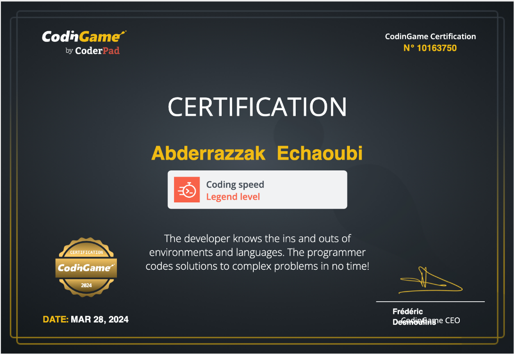

 

#  &nbsp; ABDERRAZZAK ECHAOUBI &nbsp; 

  
 

## 🔗 Connect with me :

 

  

## 💻 Technologies and Tools I use:

 

  

## 📈 My GitHub stats

  

## 4️⃣2️⃣ Profile Badges

 

 

 
## 🌟 Codingame Certifications

    
    

## 🛡️ CodeWars Badge

 

 

## 🏅 Github Trophies

 

 

 

  

