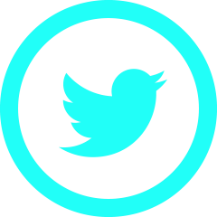

- 👋 Hi, I’m @abdochaoubi
- 👀 I’m interested in coding all the time 
- 🌱 I’m currently learning ...
- 💞️ I’m looking to collaborate on ...
- 📫 How to reach me  
  

<!---
abdochaoubi/abdochaoubi is a ✨ special ✨ repository because its `README.md` (this file) appears on your GitHub profile.
You can click the Preview link to take a look at your changes.
--->
<!DOCTYPE html>
<html>
<head>
</head>
<body>
<h2> Codewars Profile Badges</h2>

</body>
</html>
